# CETlab Command Line Interface App

<span style="font-size: 18px">Automating the Data Wrangling Process for Energy Demand Data (load)</span>
<br>
<br>

## Table of Contents

<ol type="i" style="font-size: 16px">
  <li>Authors & Acknowledgment</li>
  <li>Overview</li>
  <li>Description</li>
    <ul>
    <li>Goals</li>
      <ul>
      <li>Research Goals</li>
      <li>Project Goals</li>
      </ul>
    <li>Using this app</li>
      <ul>
      <li>Data</li>
      <li>Usage</li>
      </ul>
  </ul>
  <li>How-to Guide</li>
    <ul>
    <li>Installation</li>
      <ul>
      <li>Dependencies</li>
      <li>Modules</li>
      </ul>
    <li>Using Commands</li>
      <ul>
      <li>Steps: 1-7</li>
      </ul>
    </ul>
</ol>

## Authors & Acknowledgment

Author: [Tiana Curry](https://www.linkedin.com/in/tiana-curry/)

Thank you to the [Clean Energy Transformation Lab](https://github.com/cetlab-ucsb) at the University of California Santa Barbara, and the Prinicpal Investigator [Dr. Ranjit Deshmukh](https://cetlab.es.ucsb.edu/people/ranjit-deshmukh)

## Overview

This program is a command line interface application (CLI app), developed in Python to automate data wrangling transformations by cleaning and structuring energy demand (load) data from electricity agencies in 10 Southern African countries. The CLI app supports the data analytics and data pipeline development for the UC Santa Barbara, Bren School, Clean Energy Transformation lab (CETlab) research team.

The CETlab application was completely designed, developed, and maintain by the software engineer and data scientist Tiana Curry. This CLI app is an example of a complete project workflow from problem, idea to deployment. It is a full stack, Object-Oriented Program, Python application that solves common organization issues in data pipeline development used in the university and academic research sector.

## Description

### Goals

#### Research Goal

This program is a command line interface application (CLI app) designed to clean datasets for the UC Santa Barbara, Bren School, Clean Energy Transformation lab (CETlab) and GridPath software. The CETlab works in collaboration with specific electricity agencies and other stakeholders throughout Southern Africa to provide sustainable renewable energy. The CETlab and GridPath goal is to provide reliable renewable energy to 10+ countries throughout Africa, to support their growing economies and increase access to essential resources; while leading the way to clean energy use for large populations.

#### Project Goal

The goal of the CETlab CLI app is to automate the data wrangling, cleaning and structuring process for datasets coming from the specific electricity agencies. By providing a simple application where users can simply input their raw datasets, and the CLI app will output a clean tabular data frame, perfect for further analysis, and predictive/machine learning models. The CLI app provides data wrangling functions for electricity companies in the following Southern African countries: Angola, Eswatini, Lesotho, Malawi, Mozambique, Namibia, South Africa, Zambia, Zimbabwe. Each electricity company had different ways of collecting, storing, and documenting their data, the solution was to provide different functions for each country tailored to each electricity agencies data collection methods. The results of the application were an increase in efficiency and accuracy in analytics, initial development of the data pipeline, and a contribution of a reusable and reproducible CLI app utilize by the entire CETlab. 

### Using This App

#### Data

The data collected by the electricity agencies then used by the CETlab is not accessible to the public. So, a mock dataset was created, filled with random data points, to show functionality of the CLI app. The test input dataset and a version of the output clean data frame is provided to specifically show how the Eswatini demand data (load) was handled and structured in this application. You can find the mock input dataset and output data frame results in the `test-data` directory.

#### Usage

To use this CLI app you can download this repository to your local computer, create a virtual environment, and install the dependencies. Below you can find a quick “How-to Guide” to learn how to use, access, and run commands to clean raw datasets using the CETlab CLI app. There are data wrangling commands for all 10 countries and a set of simple test functions to see the basic functionality of this program. To only view the data wrangling functions, you can access this information in the Data Wrangling Functions Jupyter notebook. To view the complete source code for the CETlab CLI app, you can view this code in the `src` directory. The `src` directory includes two main scripts the `re_cli.py` script for command line functionality and the `re_func.py` script for data wrangling functions. 


## How to Guide

### Installation

#### Dependencies

```bash
Python==3.12.3
code==1.91.1
```

You can find the following dependencies in the requirements.txt file

```bash
DateTime==5.5
et-xmlfile==1.1.0
numpy==2.0.1
openpyxl==3.1.5
pandas==2.2.2
python-dateutil==2.9.0.post0
pytz==2024.1
setuptools==72.2.0
six==1.16.0
tzdata==2024.1
zope.interface==7.0.1
```

#### Modules

The virtual environment I created was "cetlab-cli"; and I directly imported the following <u>libraries</u>:

+ numpy
+ pandas
+ os
+ sys
+ argparse
+ datetime

I built two modules

+ `re_cli`: creates commandline application functionality
+ `re_func`: holds data wrangling functions

### Example

#### Step 1

Check if your raw data fits the strict format structure for the functions. There are four main things to check

+ the column names
+ data enteries contain a load demand per half hour
+ the number of rows
+ Date format
+ the name for each sheet.

<br>
<b>a.</b> Make sure you have four columns with the following column names 'WEEK', 'DAY', 'DATE', 'TIME', 'SYST'.
<br>
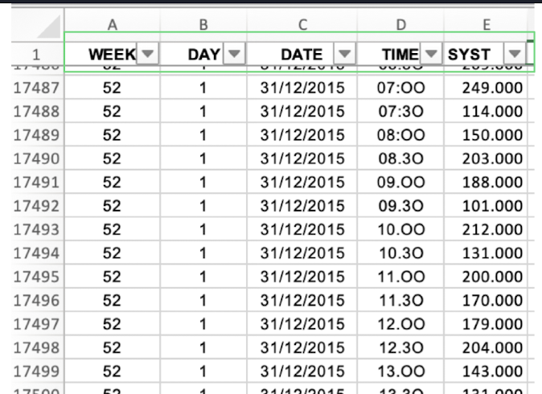
<br>

<b>b.</b> Starting from Jan 1, 20xx to Dec 31, 20xx, there should be an entry for every every half hour for every day of the year in the following format
<br>
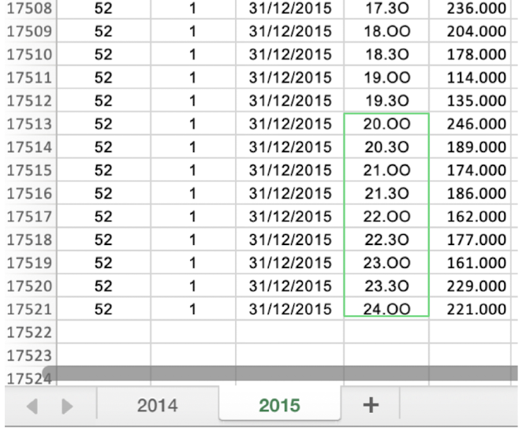
<br>

<b>c.</b> The number of rows should be 17521
<br>
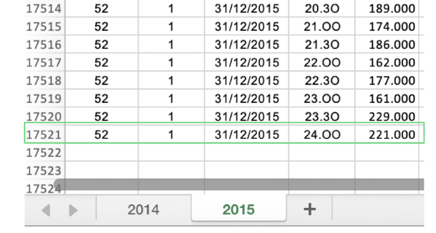
<br>

<b>d.</b> The 'DATE' column is day/month/year in the format dd/mm/yyyy
<br>
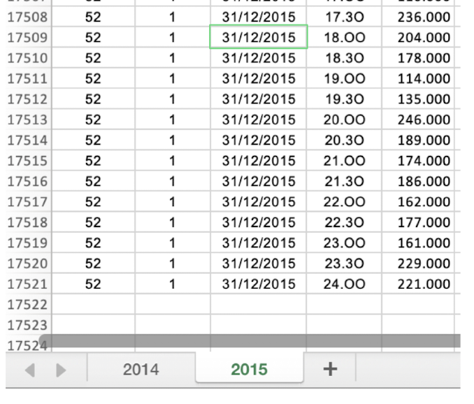
<br>

<b>e.</b> The sheet name should be a four digit year.
<br>
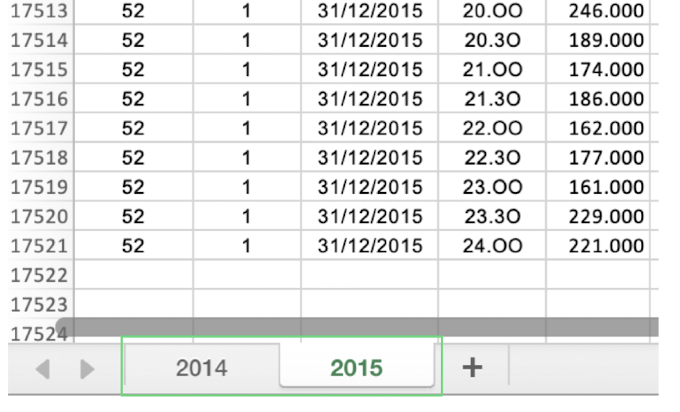

#### Step 2

Start with the 'help' command to view all command options and for momre details on the functions

```bash
% ./re_cli.py -h
```

<br>
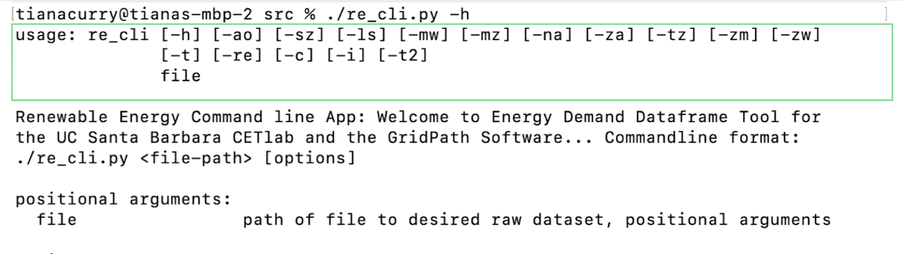

#### Step 3

We can see the command options with a more detailed description, to use the mock dataset we will use the function with the command `-sz` `--eswatini`

<br>
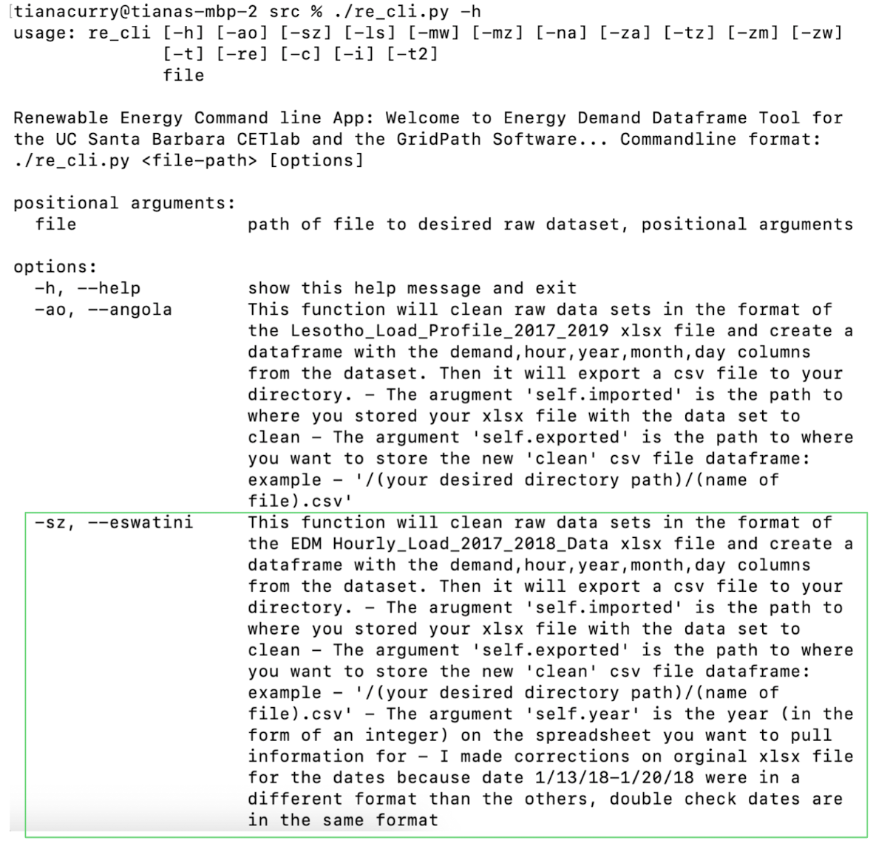

#### Step 4

Run command using mock data. We'll use the function by country two letter code name to run the command

```bash
Syntax: % ./re_cli.py <file-name> -<county-code>
```

<br>
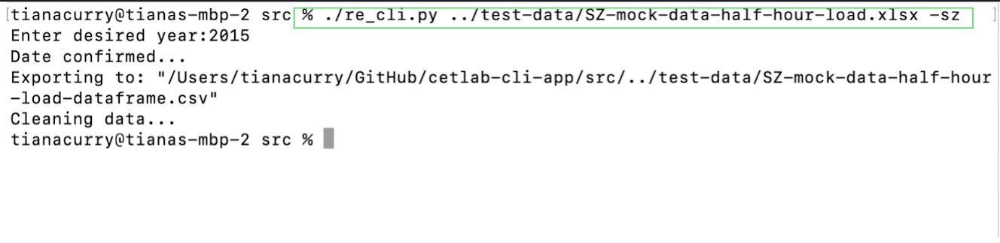

#### Step 5

Follow prompt (if provided). For the Eswatini function the prompt will be the enter the year of the Excel file sheet

<br>
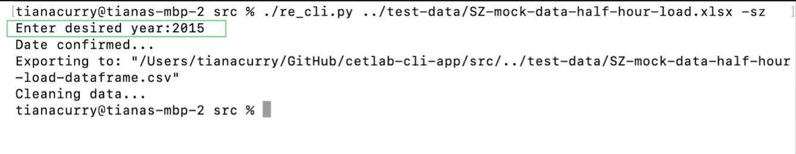

#### Step 6

Three prompts will popup if your entry is validated, indicating the data cleaning process has began. And you can locate output dataframe in current working directory under the format `<input-file-name>-dataframe.csv`

<br>
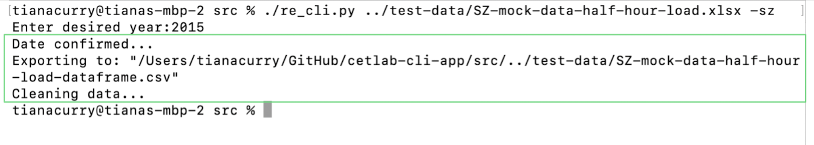

#### Step 7

View final clean tabular dataframe, ready for further analysis. Each dataframe has the same format for all countries with the following columns: 'hour', 'day', 'month', 'year', 'system_demand[mw]'

<br>
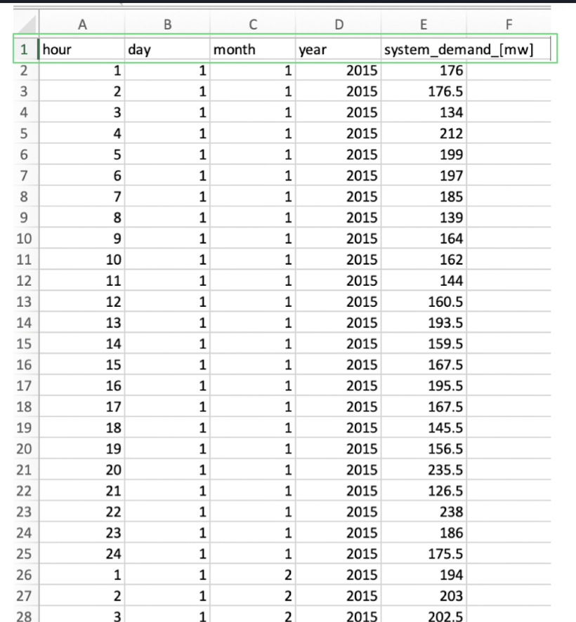

## License

This project is [MIT](https://github.com/TianaCurry/cetlab-cli-app?tab=MIT-1-ov-file) licensed
<br>
<p style="font-size: 10px">First published: 2019; last updated: 2024</p>